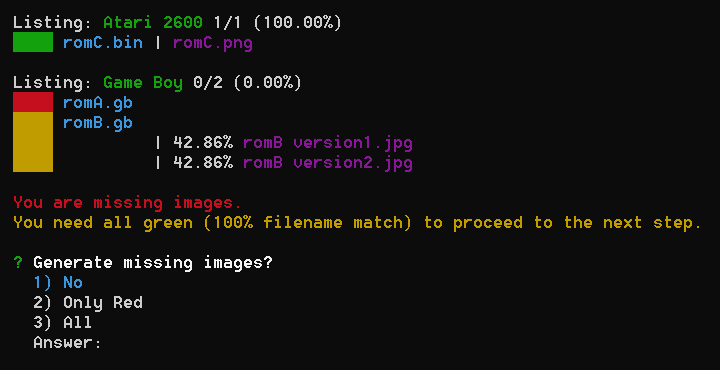

# steam-buddy-importer

Import easily multiple ROMs into steam-buddy

## Table of Contents

1. [About](#about)
2. [Usage](#usage)
   1. [Print ROMs and images](#print-roms-and-images)
   2. [Build folder structure](#build-folder-structure)
3. [Upload to Steam Buddy](#upload-to-steam-buddy)
4. [Network drives](#network-drives)

## About

This is a tool for [Steam Buddy](https://github.com/gamer-os/steam-buddy) which is implemented into [GamerOS](https://gamer-os.github.io/).

> GamerOS is an operating system that provides an out of the box couch gaming experience. After installation, boot directly into Steam Big Picture and start playing your favorite games.

> Steam Buddy is a web-based tool for installing non-Steam software to your Linux based couch gaming system. It was primarily developed for GamerOS.

Steam Buddy allows you also to play ROMs within GamerOS. It has a really nice interface, which gives you the option to upload your ROMs. You can also give them nice logos. One missing feature is to upload multiple ROMs at once. This tool will do that for you.

## Usage

You can either clone this repo and run it (you need [NodeJS](https://nodejs.org/) for it) or you can download a [bundled version](https://github.com/Cosmoledo/steam-buddy-importer/releases). The bundled version should be opened within a terminal.

Your local folder structure has to look like this:

```plaintext
in/
├── gb/
│   ├── romA.gb
│   ├── romB.gb
│   └── romB version1.jpg
│   └── romB version2.jpg
└── atari-2600/
    ├── romC.bin
    └── romC.png
```

You can define the root folder in `settings.json`. Generally you should take a look at that file.

This tool gives you a neat interface with small steps. These are described below. It will also create a log file, which is really helpful if the output is very long, but sadly you do not have any color there.

### Print ROMs and images

As you may have seen in the example structure, not every ROM has an image. Steam Buddy requires an image. It would generate a black image with the ROMs name on top, when uploading a ROM without an image, this tool can do the exact same thing.

This tool tries to find the matching image for a ROM by comparing all images for the current platform with the ROMs name. Because it can not find an exact match for all ROMs for Game Boy, you can not proceed with the process. Atari 2600 is perfect.

Here you can see the output of this:



Here you can create a simple image. It would be much better if you search for a correct logo on the internet. (This could also be a feature. Please look [here](https://github.com/Cosmoledo/steam-buddy-importer/issues/1)).

### Build folder structure

This option is only available when every entry of [Print ROMs and images](#print-roms-and-images) is green.

This will take your ROMs and their corresponding image and creates the folder structure, which Steam Buddy would also generate.

## Upload to Steam Buddy

After running all steps, you should have a folder with your ROMs and images. The easiest way to get them into Steam Buddy is Steam Buddy itself. In its settings, you can enable an FTP server. Connect to it and move the content of your folder to `/home/gamer/.local/share/steam-buddy`.

After that, you have to restart Steam as you would when uploading the traditional way. If Steam does not show any changes, do a full restart. If it still shows nothing, add any ROM with Steam Body itself, maybe there is some kind of cache.

## Network drives

It would be cool to have the files stored on an e.g. NAS and not on your machine itself ([here](https://github.com/Cosmoledo/steam-buddy-importer/issues/2)).
