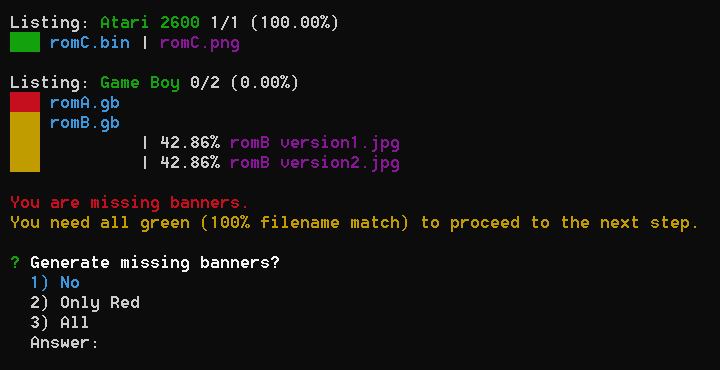

# steam-buddy-importer

Import multiple ROMs easily into steam-buddy

## Table of Contents

1. [About](#about)
2. [Usage](#usage)
   1. [Print ROMs and banners](#print-roms-and-banners)
   2. [Build folder structure](#build-folder-structure)
3. [Upload to Steam Buddy](#upload-to-steam-buddy)
4. [Existing ROMs](#existing-roms)
5. [Inner Working](#inner-working)
6. [Network drives](#network-drives)

## About

This is a tool for [Steam Buddy](https://github.com/gamer-os/steam-buddy) which is implemented into [GamerOS](https://gamer-os.github.io/).

> GamerOS is an operating system that provides an out of the box couch gaming experience. After installation, boot directly into Steam Big Picture and start playing your favorite games.

> Steam Buddy is a web-based tool for installing non-Steam software to your Linux based couch gaming system. It was primarily developed for GamerOS.

Steam Buddy allows you also to play ROMs within GamerOS. It has a really nice interface which gives you the option of uploading your ROMs. You can also give them nice logos. One missing feature is to upload multiple ROMs at once. This tool will do that for you.

## Usage

You can either clone this repo and run it (you need [NodeJS](https://nodejs.org/) for it) or you can download a [bundled version](https://github.com/Cosmoledo/steam-buddy-importer/releases). The bundled version should be opened within a terminal.

Your local folder structure has to look like this:

```plaintext
in/
├── atari-2600/
|   ├── romC.bin
|   └── romC.png
└── gb/
    ├── romA.gb
    ├── romB.gb
    ├── romB version1.jpg
    └── romB version2.jpg
```

You can define the root folder in `settings.json`. Generally, you should take a look at that file.

This tool gives you a neat interface with small steps. These are described below. It will also create a log file, which is really helpful if the output is very long, but you do not have any colors there.

### Print ROMs and banners

As you may have seen in the example structure, not every ROM has a banner. Steam Buddy requires one. It would generate a black image with the ROMs name on top, while uploading a ROM without an image, this tool can do the same thing.

This tool tries to find the matching banner for a ROM by comparing all banners for the current platform with the ROMs name. In the example, it cannot find an exact match for all ROMs in Game Boy, so you cannot proceed with the process. Atari 2600 is perfect.

Here you can see the output of this:



Here you can create a simple banner. It would be much better if you search for a correct one on the internet. (This could also be a feature, please look [here](https://github.com/Cosmoledo/steam-buddy-importer/issues/1).)

### Build folder structure

This option is only available when every entry of [Print ROMs and banners](#print-roms-and-banners) is green.

This will take your ROMs and their corresponding banner and create the folder structure, which Steam Buddy would also generate.

## Upload to Steam Buddy

After running all the steps, you should have a folder with your ROMs and banners. The easiest way to get them into Steam Buddy is Steam Buddy itself. In its settings, you can enable an FTP server. Connect to it and move the content of your folder to `/home/gamer/.local/share/`.

After that, you have to restart Steam as you would when uploading the traditional way. If Steam does not show any changes, do a full restart. If it still shows nothing, add any ROM with Steam Buddy itself, maybe there is some kind of cache.

## Existing ROMs

If you have already imported some ROMs into Steam Buddy, you have to copy some files beforehand, otherwise they would get overwritten. Go via FTP (see [Upload to Steam Buddy](#upload-to-steam-buddy)) to `/home/gamer/.local/share/steam-shortcuts`. There you should see some configuration files. Copy (do not move) them into the root folder of your new ROMs. The folder structure from above could then look like this:

```plaintext
in/
├── atari-2600/
|   ├── romC.bin
|   └── romC.png
├── gb/
|   ├── romA.gb
|   ├── romB.gb
|   ├── romB version1.jpg
|   └── romB version2.jpg
├── steam-buddy.atari-2600.yaml
└── steam-buddy.gba.yaml
```

The ROMs itself are not needed. Now you can start using the tool.

## Inner Working

As you may have seen in the folder structure above, there is this `steam-buddy.gba.yaml` file. Every platform has its own file. Let us have a look at it, the file contains many entries like this:

```yaml
- banner: /home/gamer/.local/share/steam-buddy/banners/atari-2600/Mario.png
  cmd: gba
  dir: '"/home/gamer/.local/share/steam-buddy/content/gba"'
  hidden: false
  name: Mario
  params: '"Mario.gba"'
  tags:
    - Game Boy
```

The direct path of the banner is listed there and when you combine `dir` and `params` you get the path of the ROM. So you could also have a completely different structure, but the intended one is simple and obvious.

`tags` is really interesting, this will be imported into Steam and then you can filter for it. You can add your own here. So you could give every `Super Mario` game the same filter, so that you can see them grouped by that.

## Network drives

As shown above, you can modify the path of the banner and the ROM. It is also possible that the file, the paths are pointing to, is a symlink. So with this it could/should be possible to have everything stored on your Network like on a NAS ([here](https://github.com/Cosmoledo/steam-buddy-importer/issues/2)).
